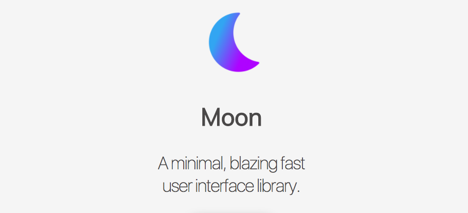

title: BeerJS Theme
author:
  name: Jorge Epuñan H.
  twitter: beerjssantiago
  url: http://www.beerjs.cl
output: index.html
theme: juanbrujo/cleaver-beerjs

--

# [MoonlettaJS](https://github.com/juanbrujo/moonlettajs)
## Implementación del cálculo de Boletta con la librería [MoonJS](http://moonjs.ga/)
-
## BeerJS Santiago - Abril 2017

--



--

### MoonJS

- 5kb .min
- Virtual DOM
- API _súper-mega-simple_

--

```html
<div id='app'>
  <h1>{{msg}}</h1>
</div>
```

```js
var app = new Moon({
  el: '#app',
  data: {
    msg: 'Hello Moon!'
  }
});
```

--

### Manipulando Data

```js
var app = new Moon({
  el: '#app',
  data: {
    msg: 'Hello Moon!'
  }
});

app.set('msg', "Bye Moon!");
```

--

### Métodos

```js
var app = new Moon({
  el: '#app',
  data: {
    msg: 'Hello Moon!'
  },
  methods: {
    changeMessage: function(msg) {
      this.set('msg', msg);
    }
  }
});

app.callMethod('changeMessage', ['Bye Moon!']);
```

--

### Condiciones

```html
<div id="app">
  <p m-if="{{condition}}">The Condition is True!</p>
</div>
```

```js
var app = new Moon({
  el: '#app',
  data: {
    condition: true
  }
});
```

--

### Loops

```html
<div id="app">
  <ul>
    <li m-for="item in {{list}}">{{item}}</li>
  </ul>
</div>
```

```js
var app = new Moon({
  el: "#app",
  data: {
    list: ['Item - 1', 'Item - 2', 'Item - 3', 'Item - 4']
  }
});
```

--

### Componentes

```html
<div id="app">
  <component></component>
</div>
```

```js
Moon.component('component', {
  template: "<p>This is a Component!</p>"
});

var app = new Moon({
  el: "#app"
});
```

--

### Props

```html
<div id="app">
  <component content="{{parentMsg}}"></component>
</div>
```

```js
Moon.component('component', {
  props: ['content'],
  template: "<p>Data from Parent: {{content}}</p>"
});

var app = new Moon({
  el: "#app",
  data: {
    parentMsg: "Parent Data"
  }
});
```

--

### Instancias

```js
new Moon({
  hooks: {
    init: function() {
      // called when first creating
    },
    mounted: function() {
      // called when element is mounted and the first build has been run
    },
    updated: function() {
      // called every time data is updated
    },
    destroyed: function() {
      // called when it is destroyed, the component might be removed
      // from the DOM
    }
  }
});

app.destroy();
```

--

### Ejemplo: MD2HTML

[Link: MD2HTML](http://md2html-otbkcjiewm.now.sh/)

```js
var app = new Moon({
  el: "#app",
  data: {
    input: "# Hello Moon",
  },
  methods: {
    update: function(evt) {
      this.set('input', evt.target.value);
    }
  },
  computed: {
    html: {
      get: function() {
        return marked(this.get('input'));
      }
    }
  }
});
```


